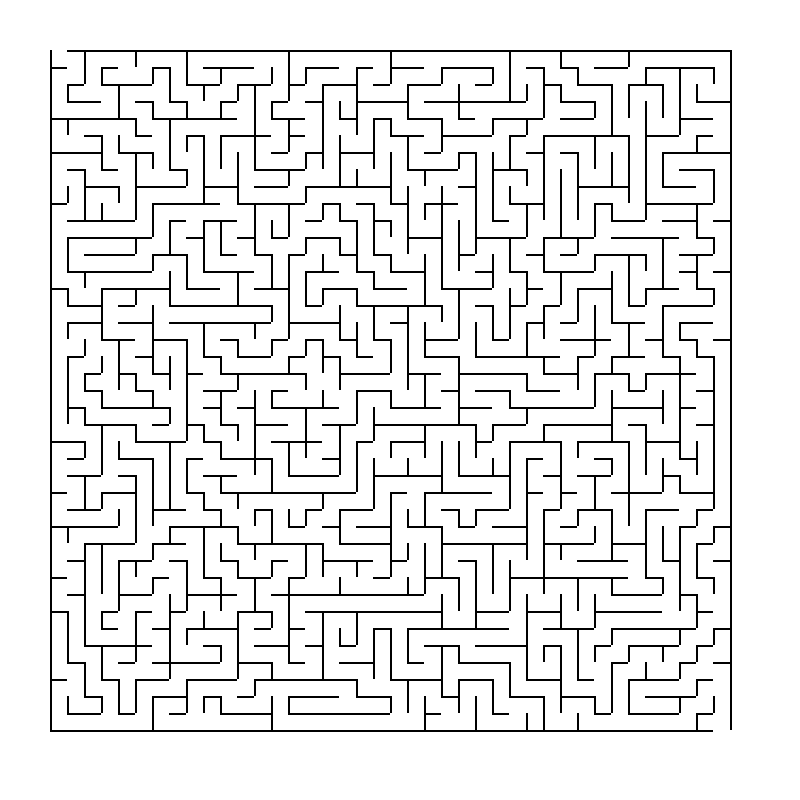

# Maze-Rust

A maze generation program written in Rust.



## Features

- Generates mazes in PNG and/or JSON format.
- Saves to files with unique UUID file names.
- Batch mode allows generating many mazes at once.
    - On my laptop, can generate 1000 40x40 mazes in PNG and JSON format in
      about 17 seconds.
- Specify the size of the maze to generate.
- Uses the recursive backtracker algorithm.
- GUI mode generates mazes and displays them.

## Usage

At the terminal type `maze -h` for help, output below.

```
Maze Generator 0.2.0
Kurt Symanzik <kurt@kbsymanzik.org>
Generates mazes

USAGE:
    maze [FLAGS] [OPTIONS]

FLAGS:
    -g, --gui        Show a graphical user interface, i.e. window.
    -h, --help       Prints help information
    -j, --json       Output the maze(s) in JSON format.
    -p, --png        Output the maze(s) in PNG format.
    -V, --version    Prints version information

OPTIONS:
    -b, --batch <batch>    Batch mode generates many mazes at once.
    -s, --size <size>      Size of the maze, i.e. number of cells wide and high.
```

## Credits

- A thank you to Tomas Korcak and his [Maze](https://github.com/korczis/maze-rs)
project for some of the ideas that found their way into this project. As my
first Rust project, I gained a lot by looking at Tomas' code.
- Another thank you to Jamis Buck and his book, "Mazes for Programmers: Code
Your Own Twisty Lttle Passages", for the recursive backtracker algorithm.
